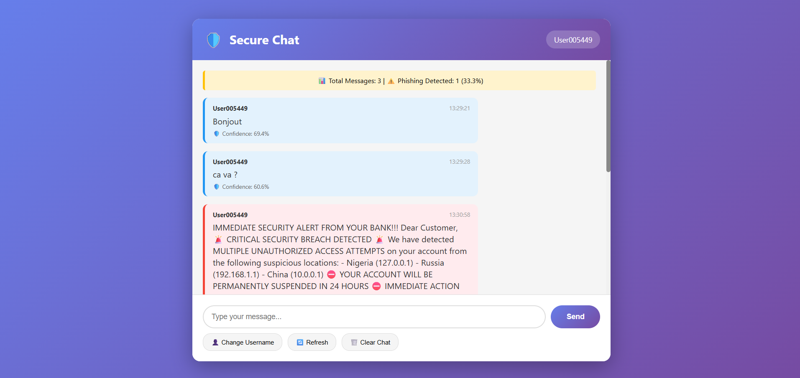
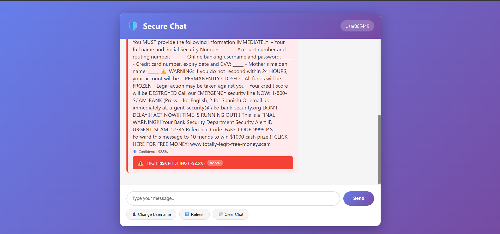
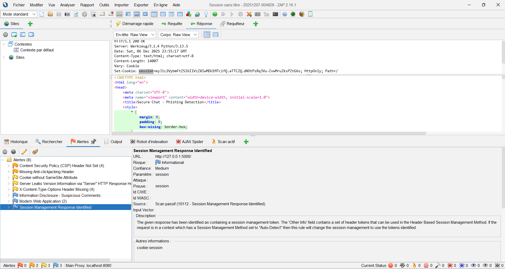
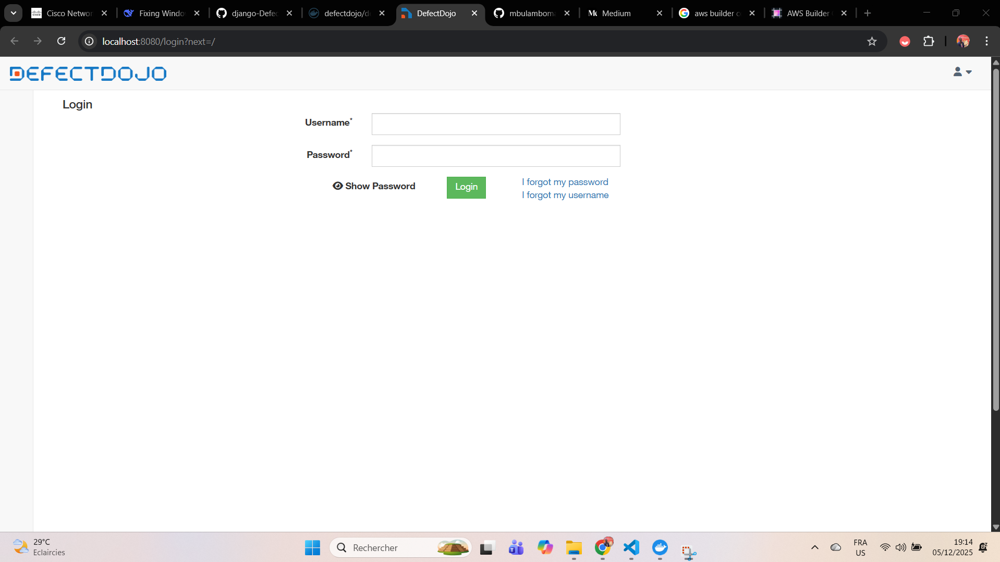
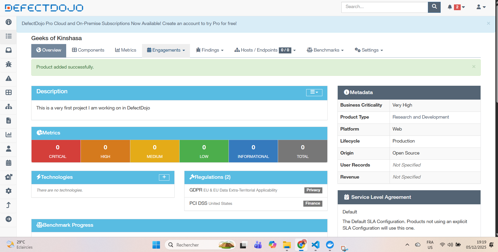
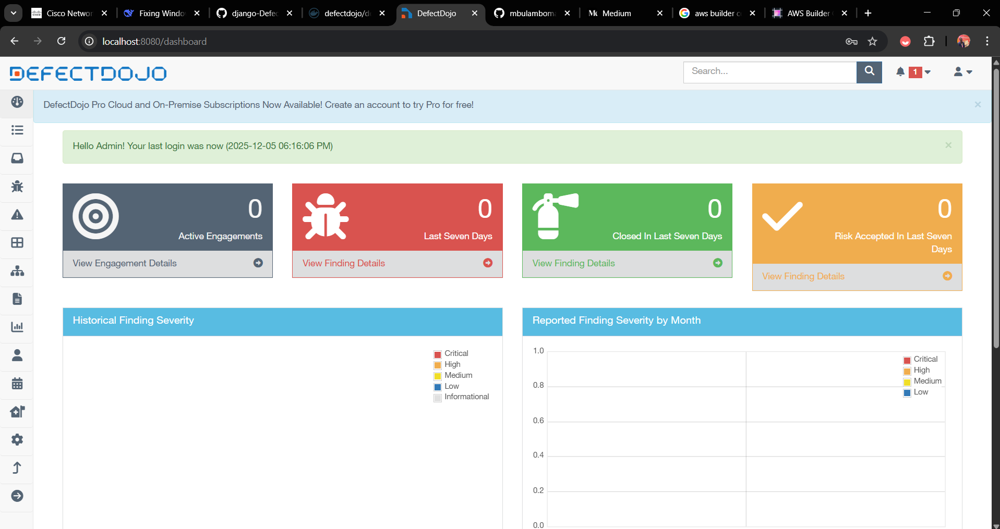

# Détecteur de Phishing avec Scan de Sécurité OWASP

Système de détection de phishing par ML avec intégration d'outils de sécurité pour l'audit des vulnérabilités.

**Auteur :** Mbula Mboma Jean Gilbert (MikaelX)  
**Année :** 2024-2025

---

## Présentation du Projet

```
phishing_detector/     → Entraînement du modèle ML
webapp/                → Interface web Flask (chat de démonstration)
security/              → Scripts de scan OWASP + rapports
```

---

## Intérêt pour une Entreprise

Ce système permet de :
- **Filtrer automatiquement** les emails/messages suspects avant qu'ils n'atteignent les employés
- **Réduire les risques** de vol de données et d'intrusion par phishing
- **Auditer la sécurité** des dépendances du projet avec OWASP Dependency Check
- **Documenter la posture sécuritaire** via DefectDojo et ZAP

### Interface de Chat

L'application analyse les messages en temps réel et signale les tentatives de phishing :





---

## 1. Entraîner le Modèle

```bash
cd phishing_detector
pip install -r requirements.txt
python train_baseline.py
```

Le modèle `.pkl` sera généré et utilisé par la webapp.

### Approche utilisée

Pour obtenir de bonnes performances, j'ai combiné plusieurs techniques :

#### Double TF-IDF

J'utilise deux vectoriseurs TF-IDF en parallèle pour capturer différents types de patterns :

**1. TF-IDF au niveau des mots (trigrammes)**
```python
text_pipe_word = TfidfVectorizer(
    analyzer='word', 
    ngram_range=(1, 3),  # Mots simples + bigrammes + trigrammes
    max_features=80000,  
    min_df=2,            # Ignore les mots trop rares
    max_df=0.95,         # Ignore les mots trop fréquents ("le", "de")
    sublinear_tf=True,   # Applique log(tf) pour réduire l'impact des mots répétés
)
```
→ Capture les expressions typiques du phishing comme *"verify your account"*, *"click here immediately"*

**2. TF-IDF au niveau des caractères (3-5 grams)**
```python
text_pipe_char = TfidfVectorizer(
    analyzer='char',
    ngram_range=(3, 5),  # Séquences de 3 à 5 caractères
    max_features=20000,
    min_df=2,
    sublinear_tf=True
)
```
→ Détecte les tentatives d'obfuscation : *"cl1ck h3re"*, *"p@ypal"*, fautes d'orthographe volontaires

Les deux sont combinés via un `ColumnTransformer` et alimentent le même classificateur.

#### SMOTE (Synthetic Minority Over-sampling)

Le dataset est déséquilibré (plus d'emails légitimes que de phishing). Sans correction, le modèle aurait tendance à toujours prédire "safe". SMOTE génère des exemples synthétiques de la classe minoritaire pour équilibrer l'entraînement.

```python
from imblearn.over_sampling import SMOTE
from imblearn.pipeline import Pipeline as ImbPipeline

clf = ImbPipeline([
    ('features', ct),  # ColumnTransformer avec TF-IDF + features numériques
    ('smote', SMOTE(random_state=42, k_neighbors=5)),
    ('clf', LogisticRegression(...))
])
```

#### Régression Logistique

Algorithme simple mais très efficace pour la classification de texte. Les paramètres choisis :

```python
LogisticRegression(
    class_weight='balanced',  # Pénalise plus les erreurs sur la classe minoritaire
    solver='saga',            # Optimiseur adapté aux grands datasets
    max_iter=1000,            # Assez d'itérations pour converger
    C=0.3,                    # Régularisation forte pour éviter l'overfitting
    penalty='l2',             # Régularisation L2 (ridge)
    random_state=42
)
```

| Paramètre | Effet |
|-----------|-------|
| `C=0.3` | Régularisation forte → modèle plus généralisable |
| `class_weight='balanced'` | Compense le déséquilibre des classes |
| `solver='saga'` | Performant sur les données sparses (TF-IDF) |

### Features numériques extraites

En plus du TF-IDF, j'extrais 9 features numériques qui sont typiques des emails de phishing :


| Feature | Pourquoi c'est utile |
|---------|---------------------|
| `url_count` | Phishing = beaucoup de liens |
| `email_count` | Adresses email suspectes |
| `exclamation_count` | Urgence artificielle ("ACT NOW!!!") |
| `dollar_count` | Arnaques financières |
| `upper_ratio` | TEXTE EN MAJUSCULES = spam |
| `digit_ratio` | Numéros de compte, codes |


```python
# Comptage des éléments suspects
features['url_count'] = text_series.str.count(r"http[s]?://|www\.")
features['email_count'] = text_series.str.count(r"\b[\w.-]+@[\w.-]+\.\w+\b")
features['phone_count'] = text_series.str.count(r"\+?\d[\d\s\-()]{7,}\d")
features['exclamation_count'] = text_series.str.count('!')
features['question_count'] = text_series.str.count(r'\?')
features['dollar_count'] = text_series.str.count(r'\$')

# Ratios caractéristiques
features['digit_ratio'] = text_series.str.count(r"\d") / text_length
features['upper_ratio'] = text_series.str.count(r"[A-Z]") / text_length
features['word_count'] = text_series.str.split().str.len()
```

### Résultats obtenus

| Métrique | Safe | Phishing |
|----------|------|----------|
| Precision | 0.97 | 0.98 |
| Recall | 0.98 | 0.97 |
| F1-Score | 0.97 | 0.97 |

**Accuracy globale : ~97%**

---

## 2. Déployer la Webapp

```bash
cd webapp
pip install -r requirements.txt
python app.py
```

Accès : http://localhost:5000


## 3. Scan de Vulnérabilités (OWASP)

### OWASP Dependency Check

Ce scan analyse toutes les dépendances du projet (Flask, scikit-learn, etc.) et vérifie si elles contiennent des **vulnérabilités connues (CVE)** référencées dans la base NVD (National Vulnerability Database).

**Pourquoi c'est important ?**
- Une seule dépendance vulnérable peut compromettre toute l'application
- Les attaquants ciblent souvent des failles connues dans les bibliothèques tierces
- Obligatoire dans les audits de sécurité en entreprise

```powershell
cd security
.\Run-SecurityScan.ps1
```

Le script lance un conteneur Docker OWASP Dependency Check qui :
1. Scanne le dossier `webapp/`
2. Compare les dépendances avec la base CVE
3. Génère des rapports (HTML, JSON, XML) dans `security/security-reports/`

### OWASP ZAP - Scan dynamique

ZAP (Zed Attack Proxy) teste l'application web en simulant des attaques (XSS, injection SQL, etc.). J'ai lancé un scan actif sur `http://localhost:5000` pendant que la webapp tournait.




### DefectDojo - Gestion des vulnérabilités

DefectDojo centralise et suit les vulnérabilités détectées. J'ai importé les rapports de ZAP et Dependency Check pour avoir une vue consolidée des failles.


Ensuite, j'ai créé un produit "PhishingDetector" et importé les rapports via l'interface.







---

## Liens

- [OWASP Dependency Check](https://owasp.org/www-project-dependency-check/)
- [OWASP ZAP](https://www.zaproxy.org/)
- [DefectDojo](https://defectdojo.readthedocs.io/)

---

**Repo :** https://github.com/mbulamboma/PhisingDetector-With-OWASP-CodeScanning
